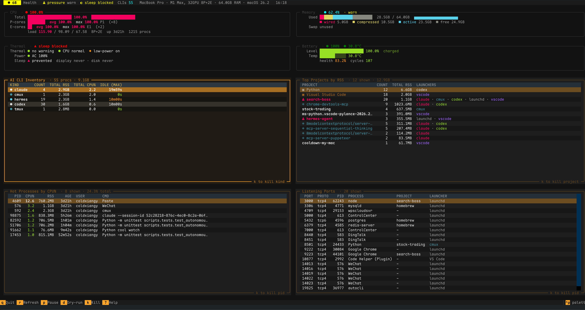

# cooldown-my-mac

[English](./README.en.md) · **中文**

<p align="center">
  
</p>

<p align="center">
  <b>AI vibe coding 时代的 Mac 退烧 CLI</b><br>
  你以为只是和 AI 聊几句天，你的 Mac 已经被 100+ 个失控的 node 进程烤穿了。
</p>

<p align="center">
  <a href="https://pypi.org/project/cooldown-my-mac/"></a>
  
  
  
  
</p>

---

## 你的 Mac 怎么又卡了？

AI vibe coding 时代，Mac 卡顿的元凶变了：

- 🥵 **明明只是开着 Claude / Cursor 聊天，风扇却响一整天** —— 多半是某个 AI 会话退出后，MCP server 没跟着退
- 🧠 **内存压力告警，Activity Monitor 翻开全是 `node`** —— 5 个 AI CLI 各启动一套 chrome-devtools-mcp / sequential-thinking / filesystem MCP，加起来 100+ 个 node 进程吃 4 GB+
- 👻 **退出 Cursor / Codex / Droid 后 CPU 还在飙** —— 子进程没跟着死，孤儿挂在 launchd 下被永远遗忘
- 🌳 **几个月前 AI 帮你跑起来的 `next dev` / `vite` 还在后台跑** —— 你早就忘了它的存在，它没忘记吃你内存
- 🚀 **重启后又一堆 LaunchAgent 自动起来** —— Cursor / Claude Desktop / Codex / Raycast / 各种 IM 全要常驻

`cool` 是一个为 AI vibe coder 写的 macOS CLI：把每个进程归到「**项目 / AI CLI / 启动器**」三个维度，告诉你那 100 个 node 到底是谁的、在干什么、能不能整族 reap。配套内存压力守护、24/7 launchd 托管、JSONL 全量审计。

它**不替代** [Mole](https://github.com/tw93/Mole)（磁盘清理）/ [mactop](https://github.com/context-labs/mactop)（硬件读数）/ [stats](https://github.com/exelban/stats)（菜单栏）—— 它补上 AI 时代它们不管的那块：**被 AI agent 拉起的失控 dev 进程群**。

## 核心能力

**AI CLI 家族感知** *(为 vibe coding 而生)*
- 内置识别 droid · codex · claude · opencode · cursor-agent · aider · hermes · cmux · gemini-cli ... 聚合显示，整族 reap
- 自动识别 MCP server（chrome-devtools-mcp / sequential-thinking / filesystem / 任意 npx 包），不会污染你真正项目的统计
- 每个 dev 进程归到「项目根 + 启动器 + 语言/框架」，7 级 fallback 链兜底（永远不会出现 `cwd unknown`）

**CPU runaway 可见**
- `Hot Processes by CPU%` 面板按 CPU% 排出当前 TOP 进程，**不限 AI 家族**——MCP 子脚本、Chrome renderer、第三方 GUI 全都浮上来
- 单核占用 ≥ 80% 直接标红，肉眼可见"哪一个 PID 在死循环"
- `cool status` 和 `cool watch` 共用同一规则，按 `k` 杀掉刚刚视觉锁定的 PID

**硬件感知**
- 电池：ioreg 解析电芯温度 / 循环 / 健康
- SMC：CPU/GPU 温度 + CPU 节流状态
- Apple Silicon P 核 / E 核分别给均值 + 最大值

**自动化 & 守护**
- 内存压力 critical 时自动 `sudo purge` + reap + macOS 通知
- 24/7 launchd 托管 + YAML 规则引擎，幂等安装
- 一键修复 displaysleep / disksleep / 睡眠阻止

**安全 & 可审计**
- 所有破坏性操作支持 `--dry-run`
- JSONL oplog 全量审计（`~/Library/Logs/cooldown/`）
- 自保护进程链 + Apple 系统进程豁免
- 默认 SIGTERM + 3s 宽限 + SIGKILL

**脚本友好**
- `status / procs / dev / ports / thermal` 全部支持 `--json`，可接 `jq` 流水线

## 凶手长这样

一台日常挂着几个 AI CLI 的 Mac 上 `cool dev` 的真实输出——你会发现自己根本不知道这些进程从哪来：

```text
PROJECT                                 #      RSS  LANGS     LAUNCHERS
────────────────────────────────────────────────────────────────────────────────
(npx: chrome-devtools-mcp)            102    4.1GB  node      claude,codex,droid
search-boss                            31    1.5GB  node      cmux,codex,launchd,vscode
(app: Visual Studio Code)              16    1.3GB  node      vscode
(npx: @modelcontextprotocol/serve...   31    1.2GB  node      claude,codex,droid
(npx: mcp-server-sequential-think...   31    925MB  node      claude,codex,droid
music-train-ios                        14    679MB  node      codex,launchd
```

**翻译一下**：claude / codex / droid 三个 AI CLI 各自启动了一份 chrome-devtools-mcp，加起来 102 个 node 进程吃 4.1 GB——这就是为什么你 Mac 在你"只是和 AI 聊天"的时候风扇起飞。`search-boss` 被 cmux / codex / launchd / vscode 4 个 launcher 同时持有，说明它至少被三个 AI 会话改过。一键就能选择整族 reap。

## 安装

```bash
pipx install cooldown-my-mac
pipx inject cooldown-my-mac textual   # 可选：启用 cool watch 全屏 TUI
```

需要 Python 3.11+（在 3.13 / 3.14 上测试）。注册两个命令：`cool`（短）和 `cooldown`（完整别名）。

<details>
<summary>从源码安装（本地开发用）</summary>

```bash
git clone https://github.com/coldxiangyu163/cooldown-my-mac.git
cd cooldown-my-mac
uv sync --extra watch --extra dev
uv run cool status
```

</details>

## 快速上手

按使用场景找命令：

| 你想... | 跑 |
|---|---|
| 不知从何下手——弹出交互式菜单 | `cool` |
| 看 Mac 整体健康（CPU / 内存 / 温度 / AI CLI 数量） | `cool status` |
| 打开全屏实时仪表盘 | `cool watch` |
| **CPU 在烧——揪出具体是哪个 PID** | `cool status` 或 `cool watch` 看 Hot Processes 面板 |
| 看哪个 AI CLI 会话最吃资源 | `cool procs` |
| 一次清掉所有闲置 30 分钟以上的 AI CLI（含 MCP 子进程） | `cool reap` |
| 看每个 dev 进程到底是哪个项目 / 哪个 AI 拉起来的 | `cool dev` |
| 查 Cursor / Claude 把哪个端口占了 | `cool ports 5432` |
| 内存压力高时自动 reap + purge | `cool pressure --watch --auto-reap --auto-purge --yes` |
| 24/7 后台守护（AI 退出忘关也不怕） | `cool daemon install` |
| 输出 JSON 接 jq / 脚本 | `cool status --json \| jq` |

## 命令一览

所有命令都接 `--help` 看完整 flag，下面只列最常用的几条。

**实时仪表盘 `cool watch`** — 双档刷新：fast tick 每 3s 采 CPU/Memory/Thermal/Battery/AI CLI/Hot Processes，slow tick 每 15s 采 Top Projects/Ports。截图见[顶部](#cooldown-my-mac)。

```text
┌─ Health · 机型 · 芯片 · RAM/Disk · macOS · uptime · 电池温度 · 内存压力 · ⟳ 3s/15s ─┐
├──────────────────────────────────┬──────────────────────────────────┤
│  CPU                             │  Memory                          │  fast (3s)
│  P 核 / E 核 均值 + 最大          │  used / avail · swap · pressure  │
├──────────────────────────────────┼──────────────────────────────────┤
│  Thermal                         │  Battery                         │  fast (3s)
│  warning · throttle · 风扇        │  % · 温度 · 循环 · 健康           │
├──────────────────────────────────┼──────────────────────────────────┤
│  AI CLI Inventory                │  Top Projects by RSS             │  slow (15s)
│  kind · count · rss · idle       │  project · # · rss · launchers   │
├──────────────────────────────────┼──────────────────────────────────┤
│  Hot Processes by CPU%           │  Listening Ports                 │  fast / slow
│  pid · cpu% · rss · age · cmd    │  port · pid · process · launcher │
└──────────────────────────────────┴──────────────────────────────────┘
```

<details>
<summary>cool watch 快捷键</summary>

| 键 | 作用 |
|----|------|
| `q` | 退出 |
| `r` / `R` | 强制快速 / 慢速刷新 |
| `p` | 暂停 / 恢复 |
| `d` | 切换 dry-run |
| `k` / `K` | `SIGTERM` / `SIGKILL` 选中行 |
| `1` / `2` / `3` / `4` | 焦点切到 AI CLI / Top Projects / Ports / Hot Processes |
| `+` / `-` | fast tick 间隔 ±1 秒 |
| `[` / `]` | slow tick 间隔 ±5 秒 |
| `Tab` / 方向键 | 表内导航 |

</details>

**开发栈洞察 `cool dev` · `cool ports`**
```bash
cool dev                          # 按项目分组：RSS / CPU / 闲置 / launcher
cool dev --by launcher --stale    # 按启动器看孤儿和老项目；--kill 进交互
cool ports 5432                   # 5432 被谁占了？--free 4000:4100 看空闲
```

**进程回收 `cool procs` · `cool reap`** — 自保护 + SIGTERM/3s/SIGKILL + [oplog](#实现细节)
```bash
cool procs                        # 列所有 AI CLI / 终端复用器，多选 kill
cool reap --dry-run               # 预览要回收的 ≥30 分钟闲置 AI CLI / tmux
cool reap --kinds droid,claude --yes        # 限定家族 + 免确认
```

**内存压力 `cool pressure`**
```bash
cool pressure --watch -n 60                                     # 持续监控
cool pressure --watch --auto-reap --auto-purge --notify --yes   # 24h 守护组合
```

**服务 & 应用 `cool services` · `cool apps`**
```bash
cool services stop mysql postgres -y                  # 开发服务批量停
cool apps suspend --kind wechat --kind dingtalk -y    # IM SIGSTOP（不退出，省 CPU）
cool apps resume --kind wechat -y                     # SIGCONT 恢复
```

**温度 / launchd / 守护 `cool thermal` · `cool launchd` · `cool daemon`**
```bash
cool thermal --restore            # 恢复 displaysleep / disksleep / powernap 默认值
cool launchd --audit --disable    # 列第三方 agent + 交互式 bootout（Apple 拒禁）
cool daemon install               # 注册 24/7 守护到 ~/Library/LaunchAgents/
```

<details>
<summary>YAML 规则配置示例（<code>~/.config/cooldown/config.yaml</code>）</summary>

```yaml
tick_interval_seconds: 120
rules:
  - name: reap-idle-ai-when-warm
    if:
      mem_pressure: [warn, critical]
      ai_idle_minutes: 30
    do:
      - reap_idle_ai
  - name: purge-on-critical
    if:
      mem_pressure: [critical]
    do:
      - purge_system
      - notify: "Memory critical — purged system caches"
```

</details>

## 菜单栏 App（Coolant）

不想开终端时，`cool` 现在也有一张脸——一个原生 SwiftUI 菜单栏应用 **Coolant**（在 [`menubar/`](./menubar/)）。

- **常驻一眼**：菜单栏一片雪花 + CPU/电池温度。健康时是单色 template 图标，安静地融进菜单栏；真出问题（thermal warning / 内存 critical / 单核烤机）才上色变红。
- **点开是一张毛玻璃仪表盘**：现状 hero 卡（AI 进程数与内存占用，渐变跟随健康状态变色）+ 健康/CPU/内存/电池指标 + 可点击的诊断徽章（烤机 / 可回收 / 内存压力，一点直达处置）+ 核心负载 + AI CLI 家族与项目占用排行 + 热进程。一键回收闲置 AI / 清理内存 / 打开 `cool watch`，所有破坏性操作都先弹确认条。深浅色全自适应；上次采样落盘缓存，点开秒显。
- **同一个数据源**：菜单栏只画图，所有读数都 shell out 调 `cool ... --json`，配色/阈值与 `cool watch` 完全一致，永不打架。

```bash
cd menubar && APP_NAME=Cooldown ./build-app.sh && open dist/Cooldown.app
```

需要 macOS 14+ 和已安装的 `cool`（`pipx install cooldown-my-mac`）。设计方案与完整说明见 [`menubar/README.md`](./menubar/README.md) 和 [`docs/menubar-design-spec.md`](./docs/menubar-design-spec.md)。

## 实现细节

两个常被问到的内部机制——展开看：

<details>
<summary>进程归因：7 级链，<code>Top Projects</code> 永远不会出现 <code>cwd unknown</code></summary>

```
┌──────────────────────────────────────────────────────────────────┐
│  1. npx cache / npm exec / 裸 MCP 工具名 → (npx: <pkg>)         │
│     避免 claude / droid 拉起的 MCP 污染项目桶                    │
├──────────────────────────────────────────────────────────────────┤
│  2. find_root(cwd) → 沿 cwd 向上找 15 种 marker（.git /          │
│     package.json / pyproject.toml / Cargo.toml / go.mod / ...）  │
│     命中 monorepo 子目录（apps/web, packages/ui）时跳到 ws 根   │
├──────────────────────────────────────────────────────────────────┤
│  3. _synthesize_app_project → cmdline / cwd 穿过 X.app/ bundle  │
│     → (app: X)，用于归类 Electron helper                         │
├──────────────────────────────────────────────────────────────────┤
│  4. _synthesize_vscode_ext_project → .vscode/extensions/<pub>.  │
│     <name>-<ver> → (vscode: name)                                │
├──────────────────────────────────────────────────────────────────┤
│  5. _synthesize_cmdline_project → 解析 --dir / --cwd / --prefix │
├──────────────────────────────────────────────────────────────────┤
│  6. _synthesize_cwd_project → cwd 磁盘已不存在时从字符串推断    │
│     （~/personal/project/X, ~/work/X, ~/code/X）                │
├──────────────────────────────────────────────────────────────────┤
│  7. _bucket_orphan_project → ppid=1 且 cwd=/ → (orphan)         │
├──────────────────────────────────────────────────────────────────┤
│  兜底 → (background: <argv0>)，按可执行名收容                    │
└──────────────────────────────────────────────────────────────────┘
```

同时对 launcher 沿 ppid 链识别 tmux · cmux · vscode · claude · droid · codex · aider · launchd 等 10+ 种会话类型。

</details>

<details>
<summary>安全细节：oplog 路径、自保护链、Apple 豁免</summary>

「核心能力」里已列出四道安全防线，下面是补充：

- **oplog 路径**：`~/Library/Logs/cooldown/operations.log`，JSONL 每行一条，记录每次 kill / suspend / bootout。设 `COOL_NO_OPLOG=1` 关掉。
- **Apple 进程豁免范围**：`cool launchd` 拒绝禁用任何匹配 `com.apple.*` / `gui/501/com.apple.*` 的 agent。
- **自保护实现**：`_self_pid_chain` 从调用进程沿 ppid 一路收到 init，整条链都不会被 reap / apps 命中。
- **幂等 daemon**：`cool daemon install` 可反复跑，不会重复注册。

</details>

## 常见问答

**Q: 会不会杀掉我正在用的 AI CLI 会话？**  
A: 不会。`reap` 默认只动 `idle_seconds >= 1800`（30 分钟无 tty 活动）的进程；你当前在交互的 Claude / Codex / Cursor 会话不会被碰。自保护链会排除 cool 自身及所有祖先。不放心先跑 `--dry-run` 看清单。

**Q: 为什么我退出 Claude / Cursor 后还有一堆 node 在跑？**  
A: 这是 MCP 架构的常见副作用——每个 AI CLI 通过 stdio 拉起独立的 MCP server 子进程，而很多 server 没实现优雅关闭，主进程退出后子进程被 launchd 收养成孤儿。`cool dev --stale` 和 `cool reap` 就是专门给这种场景写的。

**Q: 为什么要 `sudo purge`？会不会有副作用？**  
A: `purge` 是 macOS 自带命令，清理文件系统的非活跃缓存。唯一"副作用"是接下来几秒文件系统响应慢一点（因为缓存刚清空）。

**Q: 支持 Intel Mac 吗？**  
A: 支持。P/E 核拓扑会显示成 "NP+0E"（Intel 没有效能核），电池解析做了 Intel 的 deci-kelvin 温度兼容。Apple Silicon 上的电池 / 温度数据更丰富。

## 路线图

- [ ] Network 面板（上下行速率 sparkline）
- [ ] Disk Trash / 大文件快速定位
- [ ] 规则引擎 DSL 完善（复合条件、cooldown 周期）
- [ ] `cool dev --kill` 支持按组 kill（整个项目 / 整个 launcher 一键清）

<details>
<summary>和其他 Mac 工具的分工对照</summary>

`cooldown-my-mac` **不和它们竞争，建议一起用**：

| 工具 | 解决的问题 | 和 cooldown 的分工 |
|------|------|--------------------------|
| [Mole](https://github.com/tw93/Mole) | 磁盘清理 / 一次性优化 | Mole 管磁盘，cooldown 管进程 |
| [mactop](https://github.com/context-labs/mactop) · [macmon](https://github.com/vladkens/macmon) | Apple Silicon 硬件读数（GPU / ANE / 功耗）| 它们看硬件，cooldown 看用户态进程归因 |
| [stats](https://github.com/exelban/stats) | 菜单栏长期驻留 | stats 适合被动一瞥，cooldown 适合"今天怎么又卡了"时主动排查 |
| [btop++](https://github.com/aristocratos/btop) · htop | 通用进程监控 | btop 是通用工具，cooldown 针对 Mac + AI CLI 深度优化 |
| Activity Monitor | macOS 自带 | cooldown 是它的 CLI 表亲，加上项目归因和批量操作 |

</details>

## 贡献

欢迎 Issue 和 PR。本地开发：

```bash
.venv/bin/pip install -e ".[watch,dev]"
.venv/bin/python -m pytest tests/ -q       # 全部通过
.venv/bin/python -m ruff check cooldown tests
```

代码风格：Ruff（lint + format）+ 类型注解。新加的收集器 / UI 建议同时加回归测试。

## 许可证

MIT © coldxiangyu
